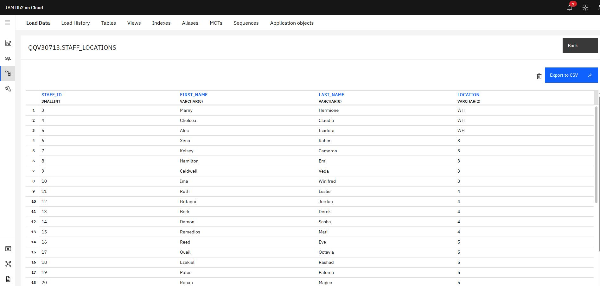

## **Task 1: Identify entities**

In relational databases, an **entity** represents a **real-world object or concept** that you want to store data about.

In the given tables


We can find the following entities:

* staff
* sales_outlet
* sales_transaction
* customer
* product

## **Task 2: Identify attributes**

***In this task, you will identify the attributes for one of the entities that you plan to create.***  

***1. Using the information from the sample data in the image from Task 1, identify the attributes for the entity that will store the sales transaction data.***  

***2. Make a list of the sales transaction attributes that you identified.***

In a database table, attributes are the columns.

Each attribute represents a specific property or characteristic of the entity that the table is modeling.

Specifically to entity *sales_transaction*, we can identify the following attributes:

* transaction_id (primary key)
* transaction_date
* transaction_time
* sales_outlet_id (foreign key -> sales_outlet)
* staff_id (foreign key -> staff)
* customer_id (foreign key -> customer)
* product_id (foreign key -> product)
* quantity
* price

## **Task 3: Create an ERD**  

***Now that you have defined some of your attributes and entities, you can determine the tables and columns for them and create an ERD.***  

***1. Open a new terminal from the side-by-side Cloud IDE.***  

***2. Use the start_postgres command to start a PostgreSQL service session in the Cloud IDE.***  

***3. Use the pgAdmin weblink to open pgAdmin in a new tab in your browser.***  

***4. Create a new database named COFFEE, view the schemas in the new COFFEE database, and then start a new ERD project.***  

***5. Add a table to the ERD for the sale transactions entity using the information in the following table. Consider what naming convention to use so that your colleagues will be able to understand your data and to ensure that the names are valid in other RDBMS. And use the sample data shown in the image in Task 1 to determine appropriate data types for each column.***  


***6. Take a screenshot of your ERD and save it as Task3A.png or Task3A.jpg.***  

***7. Add a table to the ERD for the product entity using the information in the following table. Consider what naming convention to use so that your colleagues will be able to understand your data and to ensure that the names are valid in other RDBMS. And use the sample data shown in the image in Task 1 to determine appropriate data types for each column.***  


***8. Take a screenshot of your ERD and save it as Task3B.png or Task3B.jpg.***  

## **1.**

On the ribbon in the upper part of the EDI, click on “Terminal”, and then “New Terminal”.


## **2.**

For a manual start, on the upper-left side of the EDI, click in the following order: “DATABASES”, then “PostgreSQL”, and “Create”.


Wait until it fully loads.

## **3.**

Click on the button “pgAdmin”


Wait for the page to load, or copy the link and paste it in a different tab of your browser.


## **4.**

On the upper left side of the screen, click on the icon “Servers”. 

To enter the server, you will be requested to enter the password of the user “postgres”.


To get the password,go back to the PostgreSQL tab, click on “Connection Information”, copy the string in the POSTGRES_PASSWORD section, and paste it into pgAdmin, then click on the OK button.


Right click on the “Databases” icon on the left side of the screen, then select “Create”, and “Database…”.


On the newly opened panel, write “COFFEE” in the “Database” label, then, press the “Save” button.


Check the upper left side of the screen, and select the icon “COFFEE” under “Databases”, then, click on the arrow of the icon “Schemas” and observe the options listed. Finally, go back to “COFFEE” icon and right-click it. Select “ERD For Database”.


## **5.**

Click on the “+” icon on the ERD page.


On the “General” tab of the new screen, under the “Name” lable, write “sales_transaction”; then, proceed by clicking on the “Columns” tab.


Click 9 times on the “+” on the upper-right part of the screen, so as to create 9 rows, then fill the data as reported on the table, and click the “Save” button. 


<table>
  <tr>
   <td><strong>Name</strong>
   </td>
   <td><strong>Data type</strong>
   </td>
   <td><strong>Length/Precision</strong>
   </td>
   <td><strong>Scale</strong>
   </td>
   <td><strong>Not NULL?</strong>
   </td>
   <td><strong>Primary Key</strong>
   </td>
   <td><strong>Default</strong>
   </td>
  </tr>
  <tr>
   <td>transaction_id
   </td>
   <td>integer
   </td>
   <td>
   </td>
   <td>
   </td>
   <td>
   </td>
   <td>Yes
   </td>
   <td>
   </td>
  </tr>
  <tr>
   <td>transaction_date
   </td>
   <td>date
   </td>
   <td>
   </td>
   <td>
   </td>
   <td>
   </td>
   <td>
   </td>
   <td>
   </td>
  </tr>
  <tr>
   <td>transaction_time
   </td>
   <td>time with timezone
   </td>
   <td>
   </td>
   <td>
   </td>
   <td>
   </td>
   <td>
   </td>
   <td>
   </td>
  </tr>
  <tr>
   <td>sales_outlet_id
   </td>
   <td>integer
   </td>
   <td>
   </td>
   <td>
   </td>
   <td>
   </td>
   <td>
   </td>
   <td>
   </td>
  </tr>
  <tr>
   <td>staff_id
   </td>
   <td>integer
   </td>
   <td>
   </td>
   <td>
   </td>
   <td>
   </td>
   <td>
   </td>
   <td>
   </td>
  </tr>
  <tr>
   <td>customer_id
   </td>
   <td>integer
   </td>
   <td>
   </td>
   <td>
   </td>
   <td>
   </td>
   <td>
   </td>
   <td>
   </td>
  </tr>
  <tr>
   <td>product_id
   </td>
   <td>integer
   </td>
   <td>
   </td>
   <td>
   </td>
   <td>
   </td>
   <td>
   </td>
   <td>
   </td>
  </tr>
  <tr>
   <td>quantity
   </td>
   <td>integer
   </td>
   <td>
   </td>
   <td>
   </td>
   <td>
   </td>
   <td>
   </td>
   <td>
   </td>
  </tr>
  <tr>
   <td>price
   </td>
   <td>numeric
   </td>
   <td>
   </td>
   <td>
   </td>
   <td>
   </td>
   <td>
   </td>
   <td>
   </td>
  </tr>
</table>

## **6.**

The ERD will appear on the page as follows (see also the file “Task3A” in the Tasks folder)


## **7.**

Repeat all the steps of point 5., insert “product” in the Name label, and fill the data in the table as follows. 

<table>
  <tr>
   <td><strong>Name</strong>
   </td>
   <td><strong>Data type</strong>
   </td>
   <td><strong>Length/Precision</strong>
   </td>
   <td><strong>Scale</strong>
   </td>
   <td><strong>Not NULL?</strong>
   </td>
   <td><strong>Primary Key</strong>
   </td>
   <td><strong>Default</strong>
   </td>
  </tr>
  <tr>
   <td>prdouct_id
   </td>
   <td>integer
   </td>
   <td>
   </td>
   <td>
   </td>
   <td>
   </td>
   <td>Yes
   </td>
   <td>
   </td>
  </tr>
  <tr>
   <td>product_category
   </td>
   <td>character varying
   </td>
   <td>
   </td>
   <td>
   </td>
   <td>
   </td>
   <td>
   </td>
   <td>
   </td>
  </tr>
  <tr>
   <td>prdocut_type
   </td>
   <td>character varying
   </td>
   <td>
   </td>
   <td>
   </td>
   <td>
   </td>
   <td>
   </td>
   <td>
   </td>
  </tr>
  <tr>
   <td>product_name
   </td>
   <td>character varying
   </td>
   <td>
   </td>
   <td>
   </td>
   <td>
   </td>
   <td>
   </td>
   <td>
   </td>
  </tr>
  <tr>
   <td>description
   </td>
   <td>character varying
   </td>
   <td>
   </td>
   <td>
   </td>
   <td>
   </td>
   <td>
   </td>
   <td>
   </td>
  </tr>
  <tr>
   <td>price
   </td>
   <td>numeric
   </td>
   <td>
   </td>
   <td>
   </td>
   <td>
   </td>
   <td>
   </td>
   <td>
   </td>
  </tr>
</table>

## **8.**

The ERD will appear on the page as follows (see also the file “Task3B” in the Tasks folder)


## **Task 4: Normalize tables**

***When reviewing your ERD you notice that it does not conform to second normal form. In this task, you will normalize some of the tables within the database.***

***1. Review the data in the sales transaction table. Note that the transaction id column does not contain unique values because some transactions include multiple products.***  

***2. Determine which columns should be stored in a separate table to remove the repeating rows and to put this table into second normal form.***  

***3. Add a new table named sales_detail to the ERD, define the columns in the new table, and delete the moved columns from the sales transaction table, leaving a matching column in each of two tables to later create a relationship between them.***  

***4. Take a screenshot of your ERD and save it as Task4A.png or Task4A.jpg.***  

***5. Review the data in the product table. Note that the product category and product type columns contain redundant data.***  

***6. Determine which columns should be stored in a separate table to reduce redundant data and to put this table into second normal form.***  

***7. Add a new table named product_type to the ERD, define the columns in the new table, and delete the moved columns from the product table, , leaving a matching column in each of two tables to later create a relationship between them.***  

***8. Take a screenshot of your ERD and save it as Task4B.png or Task4B.jpg.***  

## **1.**

The second normal form (2NF) is a level of database normalization used to reduce data redundancy and improve data integrity in relational databases.

### **Definition of Second Normal Form (2NF):**

A **relation is in 2NF** if:

1. It is **already in First Normal Form (1NF)** (i.e., it has only atomic values and no repeating groups), **and**
2. **All non-prime attributes are fully functionally dependent on the entire primary key**, not just part of it.

**Key Concepts:**

* **Non-prime attribute**: An attribute that is *not* part of any candidate key. 

* **Full functional dependency**: A non-prime attribute depends on the *whole* primary key, not just a part of it. 

* This rule applies **only when the primary key is composite** (i.e., consists of more than one attribute). If the primary key is a single attribute, 2NF is automatically satisfied if the table is in 1NF.

By reviewing the data in the sales_transaction table, we can observe that the column transaction_id does not contain unique values:


## **2.**

To remove the repeating rows and normalise the sales_transaction table, the following columns should be separated. 

<table>
  <tr>
   <td><strong>transaction_id</strong>
   </td>
   <td><strong>produt_id</strong>
   </td>
   <td><strong>quantity</strong>
   </td>
   <td><strong>price</strong>
   </td>
  </tr>
  <tr>
   <td>1
   </td>
   <td>38
   </td>
   <td>2
   </td>
   <td>3.75
   </td>
  </tr>
  <tr>
   <td>1
   </td>
   <td>84
   </td>
   <td>1
   </td>
   <td>0.8
   </td>
  </tr>
  <tr>
   <td>2
   </td>
   <td>51
   </td>
   <td>2
   </td>
   <td>3
   </td>
  </tr>
  <tr>
   <td>3
   </td>
   <td>33
   </td>
   <td>1
   </td>
   <td>3.5
   </td>
  </tr>
  <tr>
   <td>4
   </td>
   <td>27
   </td>
   <td>1
   </td>
   <td>3.5
   </td>
  </tr>
  <tr>
   <td>5
   </td>
   <td>24
   </td>
   <td>1
   </td>
   <td>3
   </td>
  </tr>
</table>

By doing so, after deleting these columns from the table sales_transaction (except for transaction_id, its primary key), we remove all duplicate values from the attribute transaction_id, and we obtain an entity in the first normal form. 

<table>
  <tr>
   <td>transaction_id
   </td>
   <td>transaction_date
   </td>
   <td>transaction_time
   </td>
   <td>sales_outlet
   </td>
   <td>staff_id
   </td>
   <td>customer_id
   </td>
  </tr>
  <tr>
   <td>1
   </td>
   <td>27/04/2019
   </td>
   <td>9:35:55
   </td>
   <td>8
   </td>
   <td>42
   </td>
   <td>0
   </td>
  </tr>
  <tr>
   <td>2
   </td>
   <td>27/04/2019
   </td>
   <td>8:00:34
   </td>
   <td>8
   </td>
   <td>42
   </td>
   <td>0
   </td>
  </tr>
  <tr>
   <td>3
   </td>
   <td>27/04/2019
   </td>
   <td>9:04:58
   </td>
   <td>8
   </td>
   <td>42
   </td>
   <td>0
   </td>
  </tr>
  <tr>
   <td>4
   </td>
   <td>27/04/2019
   </td>
   <td>8:48:32
   </td>
   <td>8
   </td>
   <td>42
   </td>
   <td>8232
   </td>
  </tr>
  <tr>
   <td>5
   </td>
   <td>27/04/2019
   </td>
   <td>9:21:40
   </td>
   <td>8
   </td>
   <td>42
   </td>
   <td>8232
   </td>
  </tr>
</table>


## **3.**

Repeat the Task 3 steps 1, 2, 3, 4, 5, and 6 to create the “sales_detail” table, and insert the data of the first table of Task 4, point 2. 

Set the Data type of the attributes transaction_id, product_id, and quantity as “integer”, while price must be set as “numeric”.

To delete the same attributes from the entity sales_transaction, click on the table on the screen to highlight it, then proceed by clicking on the pencil icon on the upper part of the screen.


Then, click on the “Columns” label, then click on the trash bins icons on the left of the column names “product_id”, “quantity”, and “price”, and finally, click on the “Save” button on the lower-right side of the screen.


## **4.**

The ERD screenshot will appear as follows.


## **5.**

See point 1. of this same Task for the explanation of the second normal form.

## **6.**

By observing the entity product, we see that the attributes product_category, product_type, product_name, and description contain very long strings of characters. To set the product table in the second normal form, we can keep only it’s primary key, product_id, and price, and put all the aforementioned ones in the product_type table. 

## **7.**

Repeat the Task 3 steps 1, 2, 3, 4, 5, and 6 to create the “product_type” table, and insert the data of the following table.

<table>
  <tr>
   <td>Name
   </td>
   <td>Data type
   </td>
   <td>
   </td>
  </tr>
  <tr>
   <td>product_id
   </td>
   <td>integer
   </td>
   <td>
   </td>
  </tr>
  <tr>
   <td>product_category
   </td>
   <td>character varying
   </td>
   <td>
   </td>
  </tr>
  <tr>
   <td>product_type
   </td>
   <td>character varying
   </td>
   <td>
   </td>
  </tr>
  <tr>
   <td>product_name
   </td>
   <td>character varying
   </td>
   <td>
   </td>
  </tr>
  <tr>
   <td>description
   </td>
   <td>character varying
   </td>
   <td>
   </td>
  </tr>
</table>

To delete the attributes product_category, product_type, product_name and description from the product entity, follow the steps shown in point 3. of this Task.


## **8.**

The screenshot will appear as follows.


## **Task 5: Define keys and relationships**

***After normalizing your tables, you can define their primary keys and define relationships between the tables in your ERD.***  

***1. Identify an appropriate column in each table to be a primary key and create the primary keys in the tables in your ERD.***  

***2. Take a screenshot of your ERD and save it as Task5A.png or Task5A.jpg.***  

***3. Identify the relationships between the following pairs of tables and then create the relationships in your ERD: sales_detail to***

 ***sales_transaction***  

 ***sales_detail to product***  
 
 ***product to product_type***  
 
***4. Take a screenshot of your ERD and save it as Task5B.png or Task5B.jpg.***

## **1.**

No other primary keys are supposed to be set. “transaction_id” in the sales_detail entity is supposed to be a secondary key of the same attribute in sales_transaction; in the same fashion, both the attributes “product_id” appearing in the entities sales_detail and product_type are secondary keys of the “product_id” attribute of the product table.

**2.**

The ERD will appear exactly as in Task4B. The same screenshot can be used for Task5A.


## **3**

sales_transactions and sales_detail shares the “transaction_id” attribute. 

To link them together, click on the sales_detail entity, then on the “1M” icon on the upper side of the screen.


On “Local Column” select “transaction_id”, on “Referenced Table” select “(public) sales_transaction”, and finally, on “Referenced Column”, select “transaction_id”. Then, click on the “Save” button.


Between sales_detail and product we find “product_id”; however, the primary key product_id is also intimately linked to transaction_id.

To link them together, click on the sales_detail entity, then on the “1M” icon on the upper side of the screen.

On “Local Column” select “product_id”, on “Referenced Table” select “(public) product”, and finally, on “Referenced Column”, select “product_id”. Then, click on the “Save” button.


To connect transaction_id to the primary key product_id, repeat the process, and select on Local Column “transaction_id”, for Referenced Table select “(public) product”; finally, for Referenced Column choose “product_id” and click on the save button.


Between product and product_type we have “product_id”.

To link them together, click on the product entity, then on the “1M” icon on the upper side of the screen.

On “Local Column” select “product_id”, on “Referenced Table” select “(public) product_type”, and finally, on “Referenced Column”, select “product_id”. Then, click on the “Save” button.


## **4.**

The ERD screenshot will appear as follows.


## **Task 6: Create database objects by generating and running the SQL script from the ERD Tool**

***Now that your design is complete, you will generate an SQL script from your ERD which you could use to create your database schema. For the purposes of this project, you will then use a provided SQL script to ensure that you will be able to successfully load the sample data into the schema. Finally, you will load the existing data from the various data sources into your new database schema.***  

***1. Use the Generate SQL functionality in the ERD Tool to create an SQL script from your ERD.***  

***2. Download the GeneratedScript.sql file below to your local computer storage. GeneratedScript.sql*** 

***3. In pgAdmin, open the Query Tool, upload and open the GeneratedScript.sql file from your local computer storage, and then execute the script to create the tables defined in the ERD. Verify that the tables now exist in the public schema of the COFFEE database.***  

***4. Take a screenshot of the tables shown in the tree-view pane on the left-hand side of the page and save it as Task6A.png or Task6A.jpg.***  

***5. Download the CoffeeData.sql file below to your local computer storage. CoffeeData.sql***  

***6. In pgAdmin, open another instance of the Query Tool, upload and open the CoffeeData.sql file from your local computer storage, and then execute the script to populate the tables you just created.***  

***7. In pgAdmin, view the first 100 rows of the sales_detail table.***  

***8. Take a screenshot of the Data Output pane and save it as Task6B.png or Task6B.jpg.***  

## **1.**

To do so, click on the SQL icon on the upper bar of the ERD screen.


You will be prompted on the following page.


## **2.**

The GeneratedScript.sql file can be found in the SQL folder.

## **3.**

Click on a random area of the Query Tool, click ctrl+A to select all the script, and ctrl+Z to delete everything. 

The screen should appear as follows.


Now, drag the GeneratedScript.sql file into the Query Tool; it should automatically load the script, as shown in the image.

Once visualised, click on the play-button icon in the top-centre of the screen and run it. 


## **4.**

In case the 7 tables are not immediately visualised, and you still see 4 of them in the list, left-click on the database “COFFEE” icon in the tree-view pane on the left side of the screen, then left-click on “Schemas”, then left clik “public”, and finally, right click on “Tables”, and select “Refresh”


Once refreshed, the Tables icon with the dropdown opened should appear as follows. 

## **5.**

The CofeeData.sql file can be found in the SQL folder.

## **6.**

Right click on the COFFEE database and select again “ERD For Database”.


In the ERD page, click on the SQL icon and access the Query Tool,

Repeat what is shown in step 1. by clicking on the SQL icon. Remove again all the script by typing Ctrl+A and Ctrl+Z; then, run the script. 


## **7.**

To visualise the first 100 rows of the CoffeeData.sql file, click again on the COFFEE database and select “ERD For Database” as in point 6, then, click again on the SQL icon.

On a random spot of the Query Tool, press again Ctrl+A and Ctrl+Z to cancel the whole text, and write the following SQL script:

```SQL
SELECT * FROM sales_detail LIMIT 100;
```

Run it by clicking on the Execute Query icon.


## **8.**

The Data Output pane will appear as follows. 


## **Task 7: Create a view and export the data**

***The external payroll company have requested a list of employees and the locations at which they work. This should not include the CEO or CFO who own the company. In this task, you will create a view in your PostgreSQL database that returns this information and export the results to a CSV file.***  

***1. In your COFFEE database, create a new view named staff_locations_view using the following SQL:***  

```SQL
SELECT staff.staff_id,
staff.first_name,
staff.last_name,
staff.location
FROM staff
WHERE "position" NOT IN ('CEO', 'CFO');
```
  
***2. View all the rows returned from the view.***  

***3. Save the results of the query to a file named staff_locations_view.csv on your local computer storage.***  

***4. Take a screenshot of the view shown in the tree-view pane on the left-hand side of the page alongside the results in the Data Output pane, and save it as Task7.png or Task7.jpg.***  

## **1.**

To create a view, in the right tree-view pane, click on the COFFEE icon under Databases, then open the Schemas’ dropdown, proceed with public, and then, right click the Views icon, select “Create”, and “View…”.


On the “General” label of the “Create-View” window, write “staff_locations_view”.

Click the “Code” label and paste the following code:  

```SQL
SELECT staff.staff_id,
staff.first_name,
staff.last_name,
staff.location
FROM staff
WHERE "position" NOT IN ('CEO', 'CFO');
```  

Then click on the Save button.


On the tree-view pane on the right side of the screen, you should be able to see the dropdown of the Views updated with the “staff_location_view” icon.


## **2.**

To view all the rows, right click the “staff_location_views” icon and select “View/Edit Data”, then “All Rows”.


You will be prompted again to the Query Tool, where the following SQL code  

```SQL
SELECT * FROM public.staff_locations_view
```

And all the rows will be visualised. 


## **3.**

To save the view in CSV on my local computer, click on the downward arrow icon on the bar at the centre of the screen.


The file will be automatcally saved to the local disk. 


## **4.**

Following is the Task7 screenshot.


## **Task 8: Create a materialized view and export the data**

***A marketing consultant requires access to your product data in their MySQL database for a marketing campaign. You will create a materialized view in your PostgreSQL database that returns this information and export the results to a CSV file.***  

***1. In your COFFEE database, create a new materialized view named product_info_m-view using the following SQL:***  

```SQL
SELECT product.product_name, product.description, product_type.product_category
FROM product
JOIN product_type
ON product.product_type_id = product_type.product_type_id;
```  

***2. Refresh the materialized view with data.***  

***3. View all the rows returned from the view.***  

***4. Save the results of the query to a file named product_info_m-view.csv on your local computer storage.***  

***5. Take a screenshot of the view shown in the tree-view pane on the left-hand side of the page alongside the results in the Data Output pane, and save it as Task8.png or Task8.jpg.***  

## **1.**

Similarly to the point 1 of Task1, to create a view, in the right tree-view pane, click on the COFFEE icon under Databases, then open the Schemas’ dropdown, proceed with public, and then, right click the Materialized Views icon, select “Create”, and “Materialized View…”.


On the Name parameter from the General section of the Create - Materialized View window, type “product_info_m-view”.


Then, click on the Code tab, paste the following code, and click on the Save button.  

```SQL
SELECT product.product_name, product.description, product_type.product_category
FROM product
JOIN product_type
ON product.product_type_id = product_type.product_type_id;
```


The “product_info_m-view” will appear in the dropdown on the Materialized Views of the tree-view pane.


## **2.**

Right-click on the “product_info_m-view” icon and select “Refresh View”, then click on “With data”.


The following banners should appear on the lower-right side of your screen


## **3.**

To view all rows returned from the view, right-click again on the “product_info_m-view” icon and select “View/Edit Data”, then click on “All Rows”.


You will be prompted to the Query Tool, showing all rows as follows. 


## **4.**

To save the view in CSV format on my local computer, click on the downward arrow icon on the bar at the centre of the screen.


The CSV will be automatically downloaded to your folder. 

## **5.**

Following is the Task8 screenshot.


## **Task 9: Import data into a Db2 database**  

***The external payroll company have asked you to upload the staff location information to their Db2 database.***

***1. In a new browser tab, go to [https://cloud.ibm.com/login](https://cloud.ibm.com/login), log in using your credentials, and then open a console for your Db2 on Cloud instance that you created earlier in this course.***  

***2. Use the Load Data feature to load a new table named STAFF_LOCATIONS with the staff location information saved in the staff_locations_view.csv file that you exported from the view you created in Task 7.***  

***3. Explore the new table and then view the data in it.***  

***4. Take a screenshot of the contents of the new table and save it as Task9.png or Task9.jpg.***  

## **1.**

Click on the following link:

[https://cloud.ibm.com/login](https://cloud.ibm.com/login)

Proceed by logging in with your credentials and you will be prompted in the IBM Cloud Dashboard. 

Click on the “Resource List” icon on the upper-left side of the screen.


Once in the Resource List page, click on the dropdown icon next to “Databases”, and select Db2-i8.


Then click on the “Go to UI” button.


Once inside Db2-i8, click on the Data icon on the left-side pane of the screen.


## **2.**

Once prompted on the page, the “Load Data” tab will be automatically selected. Drop the staff_locations_view.csv file on the screen (or alternatively, click on the hyperlink “Drag a file here or browse files”), and click on the “Next” button on the lower-right corner.


On the next page, click on the schema, then click on “New table”, name it “STAFF_LOCATIONS”, and then click the “Create” button.


Ensure that the “STAFF_LOCATIONS” table is checked, and click on the “Next” button. 


On the following page, click the “Begin Load” button in the lower right corner. 


Once the csv file is loaded, the screen should appear as follows. Proceed by clicking on the hyperlink “View Table”.


## **3.**

Scroll through the data and explore the table as you prefer. 

## **4.**

Following is the Task9 screenshot. 



## **Task 10: Import data into a MySQL database**

***The marketing consultant has asked you to upload the product information to their MySQL database.***  

***1. In the terminal from the side-by-side Cloud IDE, use the start_mysql command to start a My SQL service session in the Cloud IDE.***  

***2. Use the browser weblink to open phpMyAdmin in a new tab in your browser.***  

***3. In phpMyAdmin, create a new database named coffee_shop_products, and then import the product information saved in the product_info_m-view.csv file from your materialized view into a new table in the coffee_shop_products database.***  

***4. Browse the contents of the new table.***  

***5. Take a screenshot of the contents of the new table and save it as Task10.png or Task10.jpg.***  

## **1.**

In a similar fashion as with opening PostgreSQL, click on the “Skills Network Toolbox” icon, then select “Databases”, “MySQL”, and finally, click on the “Create” button.


## **2.**

Once active, click on the “Open in new browser tab” button.


## **3.**

On the tree-view on the left pane of the screen, click on the “New” icon.


Proceed by naming the database as “coffee_shop_products”, and click the “Create” button.


Click on the “Import” tab on the top bar of the screen.


Click on the “Choose File” button in the “File to import” section.


Select “product_info_m_view.csv” and click on the “Open” button.


On the “Format” section, ensure to select “CSV”.


Proceed by clicking the “Import” button at the bottom of the page. 


## **4.**

If uploaded correctly, the page should appear as follows. 

Click on the “product_info_m_view” icon on the tree-view of the left-side screen pane. 


## **5.**

Following is the Task10 screenshot. Feel free to explore the table as you wish. 


